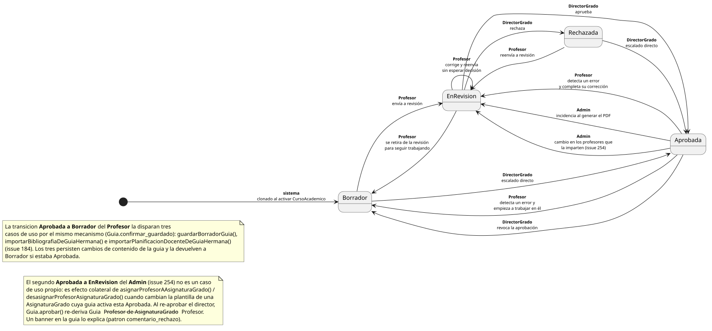

# pyCelda

**pyCelda** (**C**atálogo **E**structurado de **L**egajos **D**e **A**signaturas): gestión de guías docentes.

Prototipo navegable en Markdown, organizado por actor.

|[Profesor](/docs/PROPUESTA_WIREFRAME/profesor/iniciarSesion.md)|[Director de grado](/docs/PROPUESTA_WIREFRAME/directorGrado/iniciarSesion.md)|[Administrador](/docs/PROPUESTA_WIREFRAME/admin/iniciarSesion.md)|
|-|-|-|
Entra, ve sus asignaturas, abre la guía de una de ellas, la edita, la envía a revisión|Revisa las guías de su grado, las aprueba o las rechaza|Da de alta grados, asignaturas y profesorado
||Adicionalmente gestiona su grado: las asignaturas y resultados de aprendizaje|Genera el PDF de las guías ya aprobadas.

NOTA: Se navega a través de la tabla de la parte inferior. Si un botón no tiene enlace es porque, en ese papel, no hay permiso para pulsarlo -- restricción intencionada, no un enlace roto.

## Estados de una guía

|
|-

## Cómo está pensado por dentro

Tres piezas, de la más conceptual a la más concreta:

- **[Modelo del dominio](/RUP/00-modelo-del-dominio/README.md)** -- las entidades del sistema (`Guia`, `AsignaturaGrado`, `Profesor`...) y sus relaciones. Incluye el diagrama de estados de la `Guia`: Borrador, En revisión, Aprobada, Rechazada, y quién puede moverla de un estado a otro.
- **[Actores y casos de uso](/RUP/01-requisitos/01-actores-casos-uso/README.md)** -- los tres actores (Profesor, DirectorGrado, Admin) y el catálogo de acciones que cada uno puede invocar, con el diagrama de contexto que fija cuándo está disponible cada una.
- **[Detalle de casos de uso](/RUP/01-requisitos/03-detalle-casos-uso/README.md)** -- las 91 acciones del catálogo, una por una: especificación del comportamiento y wireframe de la pantalla. De aquí sale el prototipo de la sección anterior.

El catálogo está enlazado entre sí: el modelo de dominio justifica una regla, el diagrama de contexto fija cuándo se invoca, el detalle especifica el cómo, el prototipo lo muestra en pantalla. Se puede entrar por cualquier pieza y llegar a las demás.

---

Varias fichas citan discussions/issues del repo de trabajo privado (`github.com/mmasias/pyCelda`) donde se debatió la decisión de modelado correspondiente -- son citas de procedencia, no enlaces navegables para quien no tenga acceso a ese repo; el texto que las acompaña ya explica la decisión sin necesidad de abrirlas. Este repo tampoco incluye las fases de Análisis/Diseño (aún sin empezar) ni el dashboard de seguimiento del proyecto.
