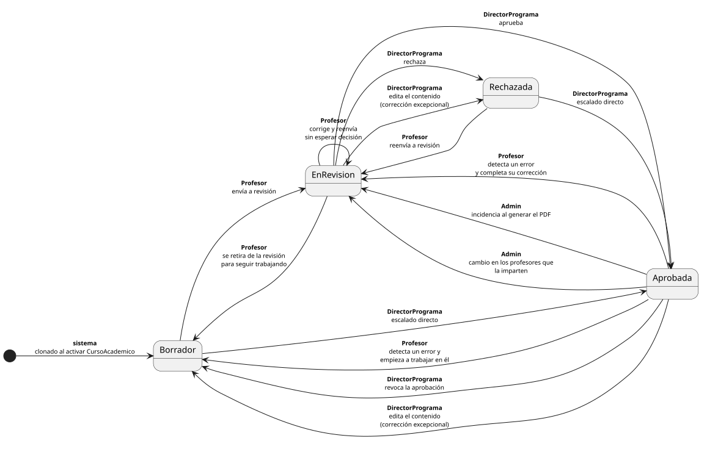

# pyCelda

***[#2think...](docs/2Think/2Think.md)***

**pyCelda** (**C**atálogo **EL**ectrónico de **D**ocumentación **A**cadémica) gestiona el ciclo de vida de las guías docentes universitarias: el profesorado las redacta, la dirección de cada programa las revisa y aprueba, y la administración mantiene el catálogo académico sobre el que se apoyan.

## Por dónde empezar

| Si quieres... | Empieza por |
|-|-|
| Entender el proyecto y cómo se ha construido | [Resumen del experimento](RESUMEN.md) |
| Ver de un vistazo qué bloques tiene el sistema y quién gestiona cada uno | [Estructura del sistema](docs/MANUAL_USUARIO/estructuraDelSistema.md) |
| Saber qué puede hacer cada rol | [Manual de usuario](#manual-de-usuario), por rol |
| Recorrer las pantallas sin instalar nada | [Prototipo navegable](#prototipo-navegable), por rol |
| Estudiar la ingeniería: modelo, requisitos, análisis, diseño y código | [Página general de RUP](RUP/README.md) y la sección [Cómo está pensado por dentro](#cómo-está-pensado-por-dentro) |
| Leer el argumentario: qué resuelve, qué garantiza y qué vendría después | [#2think](docs/2Think/2Think.md) y la nota [Dónde vive cada regla (MVC)](docs/2Think/MVCHowTo.md) |

## Manual de usuario

Antes de entrar por rol, la [estructura del sistema](docs/MANUAL_USUARIO/estructuraDelSistema.md) muestra todos los bloques y quién gestiona cada uno.

- **[Profesor](docs/MANUAL_USUARIO/profesor/README.md)**

- **[Director de Programa](docs/MANUAL_USUARIO/directorPrograma/README.md)**

- **[Administrador](docs/MANUAL_USUARIO/admin/README.md)**

## Prototipo navegable

Organizado por actor.

|[Profesor](/docs/PROPUESTA_WIREFRAME/profesor/iniciarSesion.md)|[Director de programa](/docs/PROPUESTA_WIREFRAME/directorPrograma/iniciarSesion.md)|[Administrador](/docs/PROPUESTA_WIREFRAME/admin/iniciarSesion.md)|
|-|-|-|
Entra, ve sus asignaturas, abre la guía de una de ellas, la edita, la envía a revisión|Revisa las guías de su programa, las aprueba o las rechaza|Da de alta programas, asignaturas y profesorado
||Adicionalmente gestiona su programa: las asignaturas y resultados de aprendizaje|Genera el PDF de las guías ya aprobadas.

NOTA: Se navega a través de la tabla de la parte inferior. Si un botón no tiene enlace es porque, en ese papel, no hay permiso para pulsarlo -- restricción intencionada, no un enlace roto.

## Estados de una guía

|
|-

## Cómo está pensado por dentro

Tres piezas, de la más conceptual a la más concreta. La [página general de RUP](RUP/README.md) reúne todas las fases y la trazabilidad completa de cada caso de uso.

- **[Modelo del dominio](/RUP/00-modelo-del-dominio/README.md)** -- las entidades del sistema (`Guia`, `AsignaturaPrograma`, `Profesor`...) y sus relaciones. Incluye el diagrama de estados de la `Guia`: Borrador, En revisión, Aprobada, Rechazada, y quién puede moverla de un estado a otro.
- **[Actores y casos de uso](/RUP/01-requisitos/01-actores-casos-uso/README.md)** -- los tres actores (Profesor, DirectorPrograma, Admin) y el catálogo de acciones que cada uno puede invocar, con el diagrama de contexto que fija cuándo está disponible cada una.
- **[Detalle de casos de uso](/RUP/01-requisitos/03-detalle-casos-uso/README.md)** -- las 124 acciones del catálogo, una por una: especificación del comportamiento y wireframe de la pantalla. De aquí sale el prototipo de la sección anterior.

El catálogo está enlazado entre sí: el modelo de dominio justifica una regla, el diagrama de contexto fija cuándo se invoca, el detalle especifica el cómo, el prototipo lo muestra en pantalla. Se puede entrar por cualquier pieza y llegar a las demás.

## El recorrido completo: de Requisitos a código real

121 de los 124 casos de uso tienen también **[Análisis](/RUP/02-analisis/README.md)** y **[Diseño](/RUP/03-diseño/README.md)** completos -- la traducción a clases y la secuencia de colaboración de objetos. Desde el `README.md` de cualquiera de esos 121, la cabecera de navegación lleva directo a su ficha de Análisis y de Diseño.

Y 5 de esos 121 llegan hasta **[Desarrollo](/RUP/04-desarrollo/casos-uso/README.md)**: código real de backend y frontend, elegidos como muestra representativa de patrones distintos del proyecto (creación simple, borrado protegido, autenticación, regla de negocio en el modelo, flujo con varias condiciones encadenadas) -- no los 5 más fáciles de entender.

---

Varias fichas citan discussions/issues del repo de trabajo privado (`github.com/mmasias/pyCelda`) donde se debatió la decisión de modelado correspondiente -- son citas de procedencia, no enlaces navegables para quien no tenga acceso a ese repo; el texto que las acompaña ya explica la decisión sin necesidad de abrirlas. Este repo no incluye el dashboard de seguimiento del proyecto ni el código completo de la aplicación -- solo el de los 5 casos de uso de Desarrollo elegidos como ejemplo.
